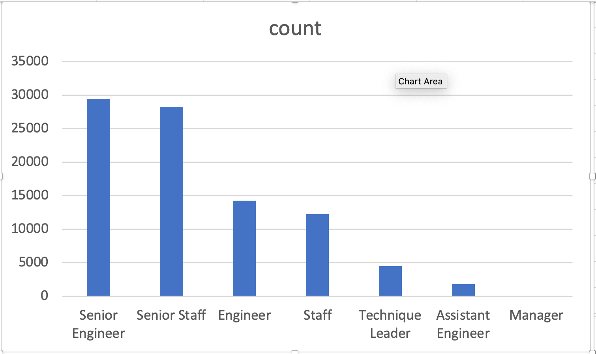
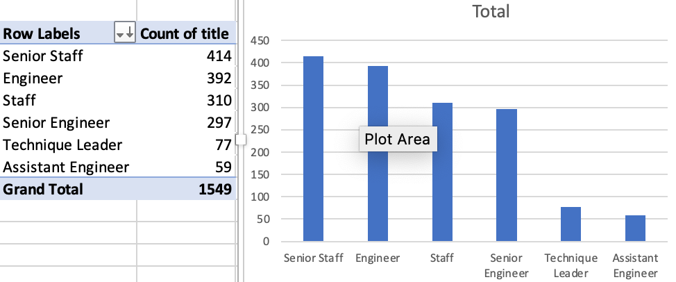

# Pewlett Hackard Analysis

## Overview:

In this project, I helped Bobby and his manager to create an Employees database; along with determine the number of retiring employees per title, and identify employees who are eligible to participate in a mentorship program. Then, I wrote a report to summarizes my analysis and helps prepare Bobby’s manager for the “silver tsunami” as many current employees reach retirement age.

## Results: 

- Deliverable 1: The Number of Retiring Employees by Title
    
    - From the image, we can see that the title with the **highest** number of retiring employees is **Senior Engineer**, with 29,414 employees. 
    - Whereas, **Manager** position had the **lowest** number of retiring employees with only 2 employees in total.
    
- Deliverable 2: The Employees Eligible for the Mentorship Program
    
    - There is a total of **1549 employees eligible** for the Mentorship program. These are **current employees who were born in 1965**.
    - The title with the **highest** number of employees eligible for this program is **Senior Staff** with 414 employees, compared to **Assistant Engineer**, which only has 59 employees qualified.


## Summary:
- How many roles will need to be filled as the "silver tsunami" begins to make an impact?
    - **90,398** roles will need to be filled since that is the number of employees/roles that will retire soon.
- Are there enough qualified, retirement-ready employees in the departments to mentor the next generation of Pewlett Hackard employees?
    - I do not think we have enough employees to mentor the next generation of this company. The two highest number of retiring titles are Senior Engineer and Senior Staff with 29,414 and 28,254 employees. However, only 297 and 414 employees of the same title are qualified for the mentorship program. That means, on average, each mentor will have to train 83 new employees. I think we should aim for a 1:30 ratio of mentor versus new employees. That means we should expand the eligible criteria, like increase the birth year to 1970, etc. to have more mentors. 
        - We can see that from this query using the **retiring_titles** and the **mentorship_eligibilty** tables:
           ```
           SELECT rt.*, z.count AS MentorCount, rt.count/z.count AS Ratio
           FROM retiring_titles rt 
           JOIN
           (SELECT COUNT(title), title
           FROM mentorship_eligibilty
           GROUP BY title
           ORDER BY 1)z
           ON rt.title = z.title
           ```
    - Another approach is to persuade the employees getting ready to retire to step back into a part-time role and mentor the new employees until all of the positions are filled. By doing this, it will solve the mentor .shoprtage problem during the beginning of the recruitment period.
        - We can utilize the **Salaries** table to see each employee's current salary that is ready to retire. Then we will add a Proposed Part-time Salary by taking the current salary divide by 3:
           ```
           SELECT e.emp_no, e.first_name, e.last_name, s.salary, s.salary/3 AS ProposedPartTimeSalary, 
		    t.title, t.from_date, t.to_date
            FROM employees e
            INNER JOIN titles t ON e.emp_no = t.emp_no
            INNER JOIN salaries s ON e.emp_no = s.emp_no
            WHERE e.birth_date BETWEEN '1952-01-01' AND '1955-12-31'
            ORDER BY e.emp_no
           ```
